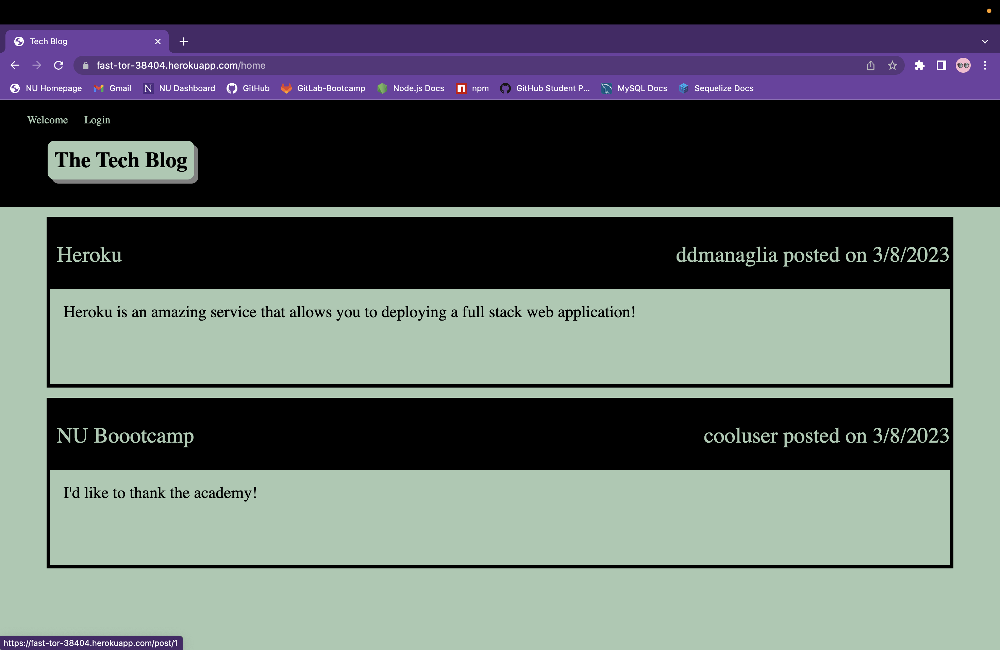
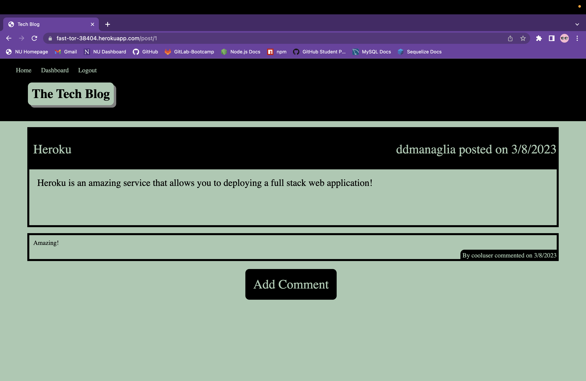
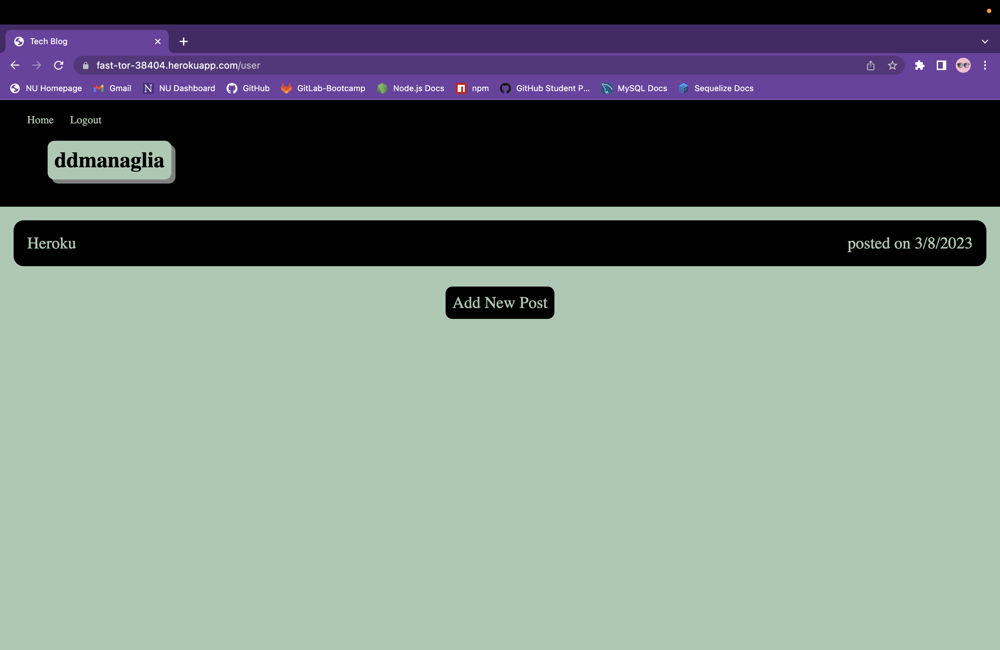
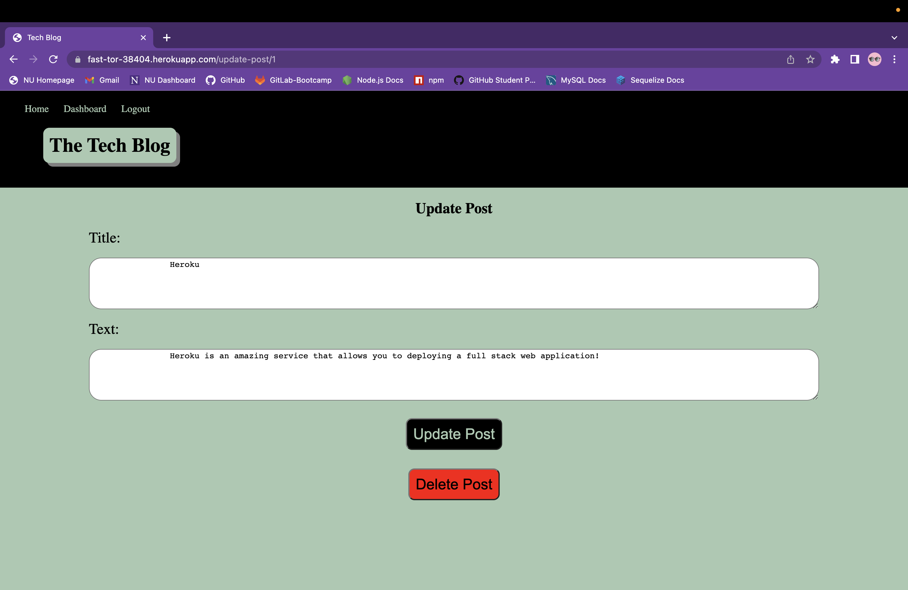

# Tech-Blog
  

  ## Description

  Stay up to date and blog about the newest trends in the tech industry! The Tech blog is a full stack web application that allows users to sign up/sign in and blog about tech! Users can add comments to posts as well as create their own posts. Users also have the ability to update and delete their old posts.
  
  ## Table of Contents
    
  * [Installation](#installation)

  * [Usage](#usage)

  * [License](#license)

  * [Test](#tests)

  * [Credits](#credits)

  * [Questions](#questions)
  
  ## Installation

  No installation necessary! Just click the link below to view:
  
  [Click to View Live Link](https://fast-tor-38404.herokuapp.com)
  
  ## Usage
  
  The application loads with a welcome page displaying basic information to users. From there users can either view the home page or login. The homepage contains all posts from all users, with the ability to click on a post to view that post's comments and the ability to add a comment. Users who aren't logged in cannot view or add comments. 
  
  

  Once users navigate to the login page they have the ability to input username and password or click sign up in the bottom right of the screen. After users have either logged in or signed up they are directed back to the home page where they now have the ability to click on posts and view comments.

  

  Logged in users also have the ability to view their own dashboard in the nav bar. 

  

  Here users can add posts or they can click on old posts of theirs and update or delete the post.

  

  It is important to note that user sessions last 1 hour. If users iddle for longer than that they will be automatically logged out and a message stating their session has exprired will be displayed.

  ## License

  This project is licensed under the MIT license.
  
  ## Tests

  For testing purposes feel free to create a new account or use the test user:

  * Username: cooluser
  * Password: cooluser123

  ## Credits

  * [Node](https://nodejs.org/en/) The application utilizes Node for the ability to run javascript from the cli as well as the ability to utilize 3rd party packages credited below.

  * [MySQL](https://www.mysql.com/) The application utilizes MySQL in order to implement persistent data.

  * [bcrypt Node package](https://www.npmjs.com/package/bcrypt) The application utilizes bcrypt to hash passwords.

  * [dotenv Node package](https://www.npmjs.com/package/dotenv) The application utilizes dotenv to safely store sensative variables.

  * [express Node package](https://www.npmjs.com/package/express) The application utilizes express to simplify all backend functionality.

  * [express-handlebars Node package](https://www.npmjs.com/package/express-handlebars) The application utilizes express-handlebars to easily interact with handlebars through express.

  * [express-session Node package](https://www.npmjs.com/package/express-session) The application utilizes express-session to track user sessions and accompanied data.

  * [handlebars Node package](https://www.npmjs.com/package/handlebars) The application utilizes handlebars to easily write and render html. 

  * [mysql2 Node package](https://www.npmjs.com/package/mysql2) The application utilizes the mysql2 package in order for javascript to easily interact with MySQL databases stored on the heroku server.

  * [sequelize Node package](https://www.npmjs.com/package/sequelize) The application utilizes sequelize to easily create and link tables in the database and easily alter the tables dynamically.

  * [Heroku](https://www.heroku.com/platform) This application utilizes the heroku platform for deployment with back end functionality.

  ## Questions

  If you have any questions about the repo, open an issue or contact me directly at ddsmm.managlia@gmail.com. You can find more of my work at [dmanaglia](https://www.github.com/dmanaglia).
  